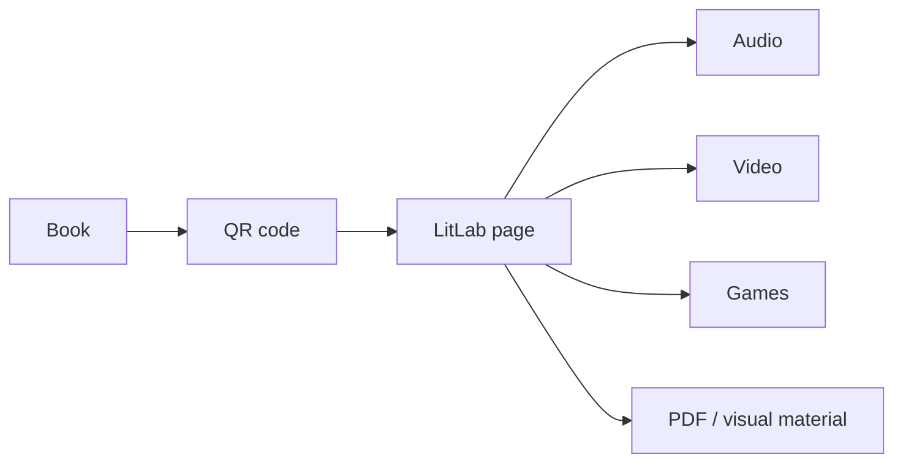

<div align="center">

# 📚 LitLab V3.0

### QR-connected multimedia literature learning

LitLab connects physical books with student-created **podcasts, videos, games, infographics, PDFs and interactive materials** through QR-linked book pages.


</div>

---

## What is LitLab?

A physical book becomes the entry point to a richer digital learning experience.

```text
Physical book → QR code → LitLab book page → Student-created media
```

The project explores how reading, classroom creativity and multimedia publishing can live in one shared library.

## Features

- 🔗 QR-connected book pages
- 🧪 universal creation form for books and projects
- 🎧 persistent audio player
- 🎭 video, PDF, visual and character-based media
- 🌍 English, Russian, Romanian and French
- 🔐 authenticated creator routes
- 🗄 Supabase database and media storage
- ⚡ Next.js App Router
- 🟢 distinctive high-contrast brutalist UI

## Tech stack

| Area | Technology |
|---|---|
| Framework | Next.js 16 |
| Language | TypeScript |
| Styling | Tailwind CSS 4 |
| Database | Supabase PostgreSQL |
| Auth | Supabase Auth |
| Storage | Supabase Storage |
| State | Zustand |
| Motion | Framer Motion |
| Icons | Lucide |

## Local setup

```bash
git clone https://github.com/xondell/litlabV3.0.git
cd litlabV3.0
npm install
```

Create `.env.local`:

```env
NEXT_PUBLIC_SUPABASE_URL=
NEXT_PUBLIC_SUPABASE_ANON_KEY=
```

Run:

```bash
npm run dev
```

## Database / storage

Apply:

```text
supabase/schema_v2.sql
```

Create public Storage buckets:

```text
covers
lab-materials
```

## Experience map



## Version note

This repository preserves the **V3.0 product baseline**.

The newer [**LitLab V4.5**](https://github.com/xondell/LitLabV4.5) evolves the concept with freemium access, subscription logic, Stripe integration and a newer Supabase model.

---

<div align="center">

**Read the book. Scan the code. Enter the lab.**

</div>
