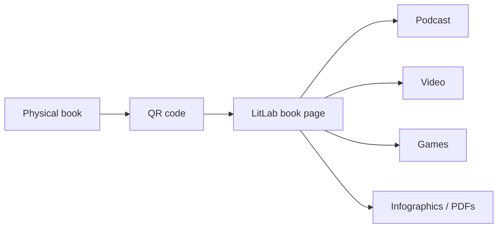

<div align="center">

# 📚 LitLab V3.0

### A multimedia literature hub that connects physical books with student-created digital experiences

Scan a book. Explore podcasts, videos, games, infographics, PDFs, and interactive materials created around literature.


</div>

---

## 💡 What is LitLab?

LitLab transforms a traditional library book into an entry point for a richer learning experience.

A physical book can be connected through a **QR code** to student-created media: podcasts, character maps, videos, games, infographics, PDFs, and other learning materials.

The result is a shared literature laboratory where reading becomes collaborative, multimedia, and easier to explore.

## ✨ Features

- 🔗 **QR-connected books** — bridge physical library books and digital content
- 🧪 **Universal content form** — create a new book or attach a project to an existing one
- 🎧 **Persistent audio player** — keep podcast playback active while navigating
- 🎭 **Interactive theater** — browse video, PDF, visual and character-based media
- 🌍 **Four languages** — English, Russian, Romanian, and French
- 🔐 **Protected creator routes** — authenticated publishing flows
- 🗄 **Supabase storage** — store covers and project media
- ⚡ **Next.js App Router** — full-stack application structure
- 🟢 **Brutalist visual identity** — high-contrast lime/black interface

## 🛠 Tech stack

| Area | Technology |
|---|---|
| Framework | Next.js 16 |
| Language | TypeScript |
| Styling | Tailwind CSS 4 |
| Database | Supabase PostgreSQL |
| Authentication | Supabase Auth |
| Storage | Supabase Storage |
| State | Zustand |
| Motion/UI | Framer Motion |
| Icons | Lucide |

## 🚀 Getting started

```bash
git clone https://github.com/xondell/litlabV3.0.git
cd litlabV3.0
npm install
```

Create `.env.local`:

```env
NEXT_PUBLIC_SUPABASE_URL=your-project-url
NEXT_PUBLIC_SUPABASE_ANON_KEY=your-anon-key
```

Start development:

```bash
npm run dev
```

## 🗄 Database setup

Run the schema from:

```text
supabase/schema_v2.sql
```

in the Supabase SQL Editor.

Create two public Storage buckets:

```text
covers
lab-materials
```

## 🧭 Core experience



## 🎨 Design language

LitLab V3.0 deliberately uses a bold visual system:

- high contrast;
- lime green + black;
- oversized typography;
- energetic motion;
- clear content hierarchy.

The style is meant to make a school literature platform feel experimental rather than institutional.

---

<div align="center">

**Read the book. Scan the code. Enter the lab.**

</div>
